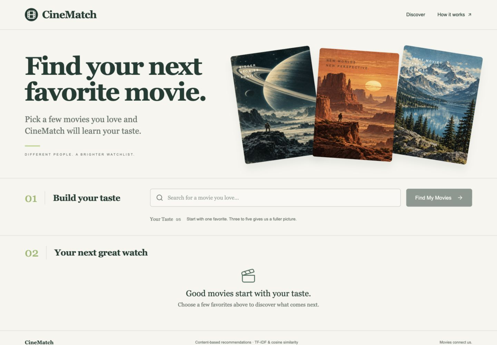
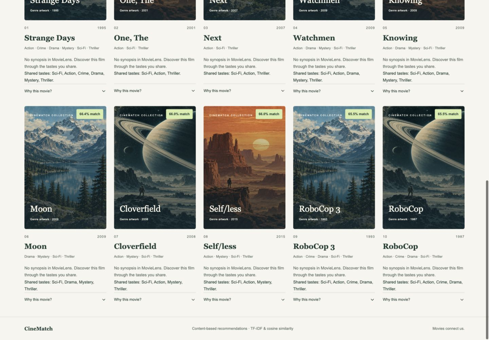
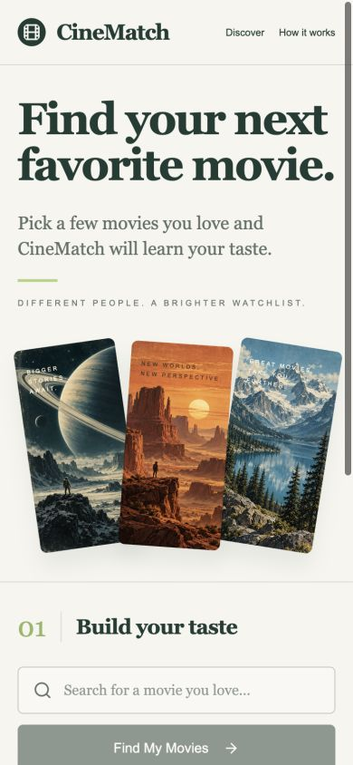
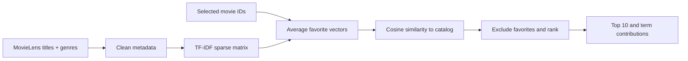
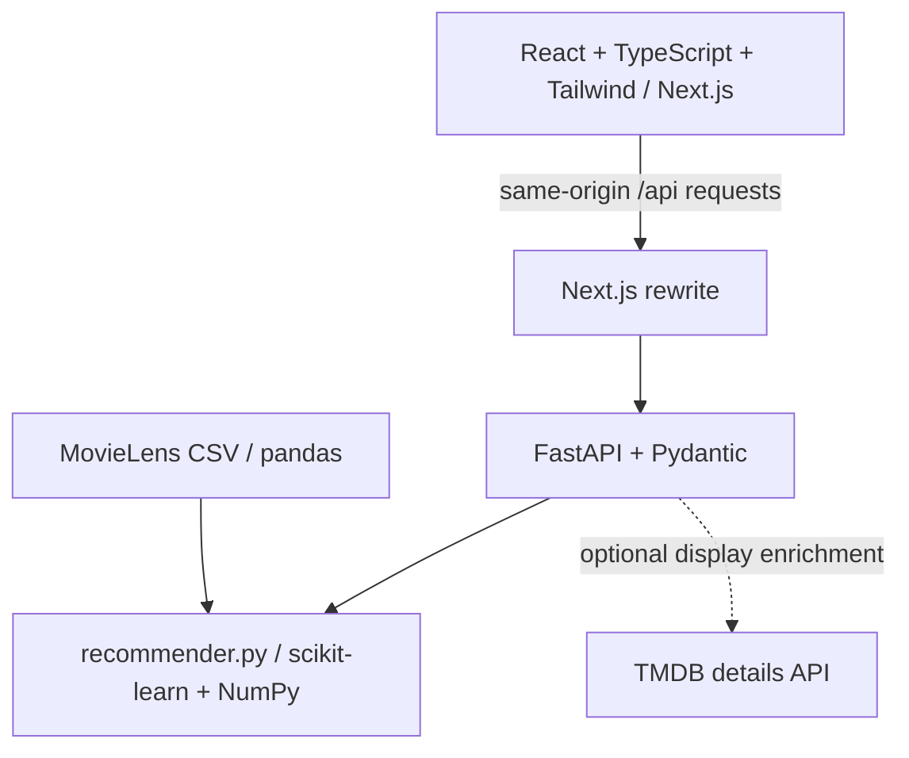

# CineMatch — Movie & Series Recommendation System

**Find your next favorite watch.** An explainable, content-based movie discovery website built with Next.js, FastAPI and scikit-learn. Choose up to five favorites and discover ten movies ranked by their actual similarity to your combined taste.

CineMatch is a beginner-friendly ML portfolio project: the recommender is small enough to study, explanations reflect the real score calculation, and an executed notebook documents the learning process. No LLM generates recommendations.

## Demo and screenshots

Local app: **http://127.0.0.1:3000** · Interactive API docs: **http://127.0.0.1:8000/docs**. No public deployment is configured.




<details><summary>Mobile screenshot</summary>



</details>

Demo script: search “Interstellar” → select it → search “Inception” → select it → **Find My Next Watch** → expand **Why this movie?** → remove Inception → generate again. The initial screen starts empty so every preference is explicitly selected.

## Movies and series update

Search and select both movies and TV series. Choose **Movies & series**, **Movies**, or **Series** under Recommend, then click **Find My Next Watch**. Filters change candidate results, while favorites may contain either type.

Choose **Netflix Originals** to restrict recommendations to a curated starter set of 25 well-known Netflix original series, including Stranger Things, The Crown, Bridgerton, Wednesday, Dark, Narcos, Money Heist, Squid Game, The Witcher and Ozark. TVmaze does not provide a complete Netflix-original flag, so this set is intentionally transparent and non-exhaustive. Netflix availability varies by country and over time; the filter describes origin, not current streaming availability.

The running app now fits one joint catalog: 9,742 MovieLens movies plus 4,721 TVmaze series. TVmaze metadata is cached locally with `python scripts/download_series.py` (no key). The default 20 index pages cover show IDs below 5,000, plus the curated Netflix starter set; neither is the full TVmaze catalog. Use `--pages N` to expand general coverage and restart the backend. Series summaries/posters are display-only; Science-Fiction is normalized to Sci-Fi for matching.

TVmaze data is attributed per series and in the footer under [CC BY-SA](https://www.tvmaze.com/api#licensing). The downloaded cache retains source links; its checksum/coverage is recorded in `backend/data/series-manifest.json`. Data terms are separate from application code.

New endpoint: `GET /titles/search?q=breaking`; `/movies/search` remains a compatibility alias for unified search. `POST /recommend` accepts optional `media_type` (`all`, `movie`, `series`). The existing `movie_ids` field now accepts catalog IDs for either type: movies keep MovieLens IDs, series use 1,000,000,000 + TVmaze ID. Always use IDs returned by search. Health reports movies, series and total titles.

**Learning baseline:** the notebook, evaluation report and numerical example below intentionally preserve the original movie-only model. Live joint-catalog scores differ because TF-IDF learns IDF across both datasets.

## Features

- Debounced title autocomplete with keyboard navigation, cancellation, and no-result feedback.
- One to five removable favorites; guidance encourages three to five.
- Ten positive content matches, excluding selected films, with deterministic tie-breaking.
- Real 0–1 cosine scores, displayed as percentages; no fabricated confidence.
- Genre overlaps and per-term score contributions in expandable explanations.
- Responsive editorial interface, original cinematic genre artwork, and accessible loading/error states.
- Optional TMDB posters/synopses; fully functional recommendations without a key.
- `/how-it-works` educational page, executed notebook, learning guide and descriptive evaluation.

## ML concepts and pipeline



Preprocessing extracts release years, normalizes punctuation/case, treats Sci-Fi as a single token and removes IMAX (format, not content). Genres are repeated three times before vectorization to emphasize them over incidental title words. This weighting is an explicit initial design choice, not an optimized result.

TF-IDF uses English stop words, Unicode accent stripping, smoothed IDF and L2 normalization. The fitted matrix has **9,742 movies × 8,914 terms** for the downloaded snapshot. Averaging selected rows creates the taste vector. We compare only this profile to the catalog, avoiding a quadratic all-pairs matrix.

## Architecture and technology



Python serves the model. React owns interaction state. Data preparation, ranking, API validation, enrichment and presentation are separate. There is no database, authentication, paid model service or persistent recommendation history.

## Local setup

Prerequisites: Python **3.12+** and Node **22+**, npm, and internet access for initial dependencies/data. This project was tested with Python 3.14.6 and Node 26.5.0 on macOS. All dependencies install inside this project; no global packages are required.

From the repository root:

```bash
python3 -m venv .venv
source .venv/bin/activate
python -m pip install -r backend/requirements.txt
python scripts/download_data.py
python scripts/download_series.py
```

If the official dataset host is unavailable, use the explicitly pinned HTTPS mirror:

```bash
python scripts/download_data.py --mirror
```

The local build used this mirror because the official host presented an expired certificate. TLS verification remains enabled. The script retains original usage terms and records checksums/source in `backend/data/manifest.json`.

Start the backend in terminal 1, **from the repository root**:

```bash
source .venv/bin/activate
python -m uvicorn backend.app.main:app --host 127.0.0.1 --port 8000
```

Start the frontend in terminal 2:

```bash
cd frontend
npm ci
npm run dev
```

Open **http://127.0.0.1:3000**. Stop either server with Ctrl+C. Windows users can activate using `.venv\Scripts\activate` and use `python` instead of `python3`.

For a production build:

```bash
cd frontend
npm run build
npm start
```

### Optional TMDB enrichment

Export `TMDB_API_KEY` in the backend shell before launching Uvicorn. The variable expects a **TMDB v3 API key**, not a bearer token. Do not put it in a `NEXT_PUBLIC_` variable or commit it. The root `.env.example` documents the variable; Python does not automatically load `.env` files. The backend uses MovieLens TMDB IDs, short timeouts, concurrent detail requests and a bounded in-memory cache. Restart to clear the cache after service failures or key changes.

TMDB adds only display posters and synopses; the TF-IDF model remains title/genre-based. No live key was available during verification, so network failures were tested with mocks. This product uses the TMDB API but is not endorsed or certified by TMDB. Review TMDB attribution/branding requirements before publicly releasing an enriched deployment.

`frontend/.env.example` documents optional server-side `BACKEND_URL`. Copy it to `frontend/.env.local` only if changing the default backend address. Production deployment would require separately hosting Python and Next.js and configuring this value; no deployment is claimed here.

## Dataset and assets

[MovieLens latest-small](https://grouplens.org/datasets/movielens/latest/) is published by GroupLens for education/development. The snapshot contains 9,742 movies and ends in 2018. V1 uses `movies.csv` and `links.csv`, not ratings or user tags. MovieLens lacks plot summaries, directors and official posters in these files. Original terms are saved as `backend/data/README.txt`; dataset files are ignored by Git and retain their own terms.

The download fallback is the public [smanihwr mirror](https://github.com/smanihwr/ml-latest-small) pinned to commit `ba3cd91761e54faa64483456b619d1a1f4d70971`. Provenance is explicit, and the downloader does not silently substitute data.

The triptych in `frontend/public/art/cinematic-triptych.png` is original generated genre artwork, not an official film poster. Its prompt and the UI concept are documented in `docs/DESIGN.md`. Generated art is separate from the deterministic recommendation engine.

## API documentation

| Method | Endpoint | Behavior |
|---|---|---|
| GET | `/health` | Status, catalog count, vocabulary size |
| GET | `/movies/search?q=interstellar&limit=8` | Case-insensitive normalized title substring search |
| POST | `/recommend` | Ranked results and explanations |

Search requires 1–100 characters; limit is 1–20. Punctuation-only queries return an empty list. Recommend accepts 1–5 positive integer IDs and limit 1–20; duplicate IDs receive one vote. Unknown IDs return **400**; invalid types/ranges or unknown request properties return **422**. If fewer positive matches exist, fewer results are returned.

```bash
curl http://127.0.0.1:8000/health
curl 'http://127.0.0.1:8000/movies/search?q=interstellar'
curl -X POST http://127.0.0.1:8000/recommend \
  -H 'Content-Type: application/json' \
  -d '{"movie_ids":[109487,79132],"limit":10}'
```

The response wraps `recommendations` and `model`. Each result includes `id`, `title`, `year`, `genres`, nullable `poster_url` and `overview`, `score`, `shared_genres`, `shared_features` (term/contribution pairs), `reasons`, `explanation`, and `selected_titles`. FastAPI’s `/docs` shows the complete generated schema.

## Actual recommendation example

Interstellar + Inception → **Strange Days (1995)**, cosine **0.698319**, displayed **69.8% match**. Shared genres: Sci-Fi, Action, Crime, Drama, Mystery and Thriller. Sci-Fi contributes 0.291049; Mystery contributes 0.143157. All six contributing terms reconstruct the score. This is not a predicted rating or probability of enjoyment.

See [LEARNING.md](LEARNING.md) for the numerical walkthrough and [evaluation](docs/EVALUATION.md) for multiple profiles and limitations. Regenerate with:

```bash
python scripts/evaluate.py
```

## Notebook

Open `notebooks/recommender_exploration.ipynb` in VS Code or Jupyter and select the `.venv` Python interpreter. The committed notebook is executed and contains dataset inspection, missing-value handling, genre plots, text preparation, TF-IDF dimensions/weights, single/multi-favorite recommendations, a reconstructed cosine score, a full score histogram and qualitative limitations. `scripts/create_notebook.py` regenerates its unexecuted source if needed.

## Tests and checks

```bash
python -m pytest backend/tests -q
cd frontend
npm run lint
npm run typecheck
npm run build
```

Tests cover search, result count, ordering, exclusion, deduplication, score range, manual cosine agreement, invalid IDs/types/limits, health and optional TMDB failure. Browser verification covers search → multiple favorites → recommendations → explanation → remove → regenerate, plus mobile layout, keyboard search and the educational page. Screenshots above are from the running app. See `docs/QA.md` for verification details and limitations.

## Project structure

```text
frontend/
  app/                 Routes, shared layout and design styles
  components/          Discovery, autocomplete and movie cards
  lib/api.ts           Typed API calls
  types/movie.ts       Movie and recommendation contracts
  public/art/          Original illustrative art
backend/
  app/data.py          Dataset loading and preprocessing
  app/recommender.py   TF-IDF, averaging, cosine and explanations
  app/schemas.py       Pydantic contracts
  app/main.py          FastAPI endpoints and startup
  app/enrichment.py    Optional TMDB display data
  data/                Downloaded CSVs, provenance and original terms
  tests/               API and algorithm tests
notebooks/             Executed learning notebook
scripts/               Dataset download, notebook source and evaluation
docs/                 Design, screenshots and evaluation evidence
README.md              Setup and portfolio overview
LEARNING.md            Beginner guide and interview preparation
```

## Limitations and future versions

Content similarity can create a similarity bubble. Movies need metadata, the catalog is dated, and genres/titles miss tone, acting and quality. Rare terms and sequels may dominate; equal genre vectors can tie. The system does not learn from other users or store preferences. Genre overlap is a circular sanity check, not independent accuracy; there is no held-out relevance benchmark or claim of user satisfaction.

- **V2:** Collaborative filtering using MovieLens ratings, with a proper held-out evaluation.
- **V3:** A hybrid recommender combining content and collaborative scores, calibrated against relevance judgments.
- **V4:** Accounts and persistent recommendation history, with deliberate data/privacy design.

## What I learned

The strongest portfolio story is the connection between feature choices and behavior: inspecting the IMAX failure, keeping sparse vectors, averaging favorites fairly, distinguishing similarity from probability, deriving explanations from term products, and testing model behavior separately from HTTP/UI behavior. Before claiming this as your own learning, run the notebook, change a genre weight, explain the resulting differences and record your experiment. [LEARNING.md](LEARNING.md) gives an exact study order and ten interview questions.

Primary references: [scikit-learn TF-IDF](https://scikit-learn.org/stable/modules/generated/sklearn.feature_extraction.text.TfidfVectorizer.html), [cosine similarity](https://scikit-learn.org/stable/modules/generated/sklearn.metrics.pairwise.cosine_similarity.html), [Next.js rewrites](https://nextjs.org/docs/app/api-reference/config/next-config-js/rewrites), [TMDB details](https://developer.themoviedb.org/reference/movie-details).
